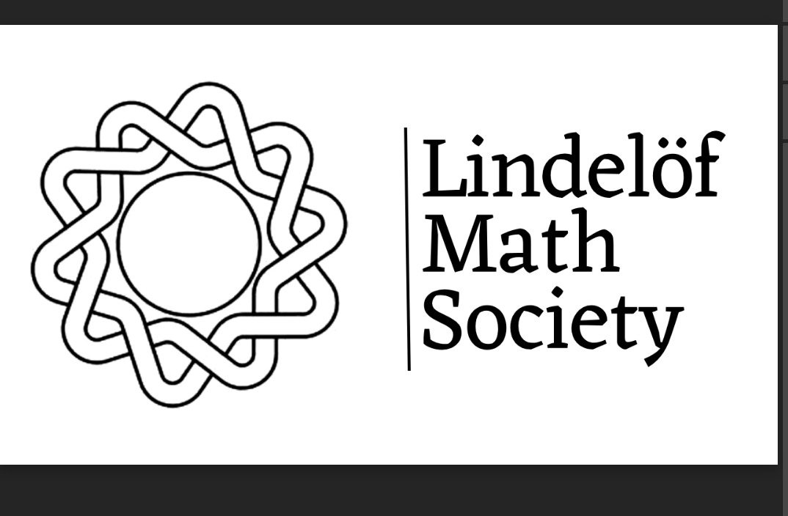

<!-- 1. Math Typesetting Engine -->

<!-- 2. Institute Logo (Pinned to top right) -->

<!-- 3. Club Logo (Centered in content area) -->

  

<!-- 4. Club Content -->
We explore the abstraction of analysis, linear algebra, group theory, and all of mathematics.

**The First Isomorphism Theorem:** Let $\phi: G \rightarrow H$ be a group homomorphism. Then the quotient group is isomorphic to the image of $\phi$:

$$G/\ker(\phi) \cong \text{im}(\phi)$$
